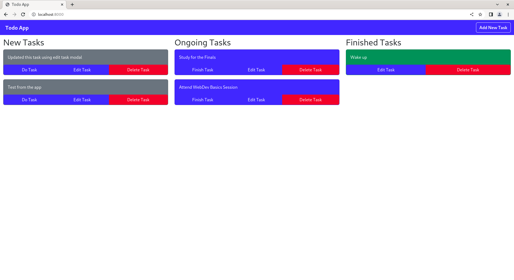

# Web Development Basics Todo App Guide
This guide will help you create your first Todo App written in PHP. This was initially made as a supplement hands-on
activity for the Web Development Basics sessions.

## Requirements
* [PHP 8](https://www.php.net/downloads.php) (installed manually or via XAMPP)
* Any text editor or IDE for PHP.
  * [VS Code](https://code.visualstudio.com/Download)
  * [PhpStorm](https://www.jetbrains.com/phpstorm/) (Paid IDE)
  * [Notepad++](https://notepad-plus-plus.org/downloads/) 
* [DBeaver](https://dbeaver.io/download/)
* [MariaDB](https://mariadb.org/download/) / [MySQL](https://www.mysql.com/downloads/) (installed manually or via XAMPP)
* [Git](https://git-scm.com/downloads) (Version Control System)
* [GitHub](https://github.com/) Account

The requirements above should be installed for you to smoothly proceed with this tutorial. It is highly recommended to
install [**XAMPP**](https://www.apachefriends.org/) since it already includes a Web Server (Apache), PHP, and a
Database Server (MySQL/MariaDB).

## Setup to run this Tutorial Locally
This tutorial guide was made using [HonKit](https://honkit.netlify.app/), a Node.js library for creating books using
markdown. This guide will help you setup and run this tutorial on your own machine.
1. Download and install the [latest LTS version of Node.js](https://nodejs.org/en).
2. After installing Node.js, clone or download this repository.
   * If you have [git](https://git-scm.com/) installed on your machine you can use the command below:
     * `git clone https://github.com/harriebird/php-todo-guide`
   * Or just download this repository directly as ZIP file. After the download, extract the ZIP.
3. After a successful repository clone or download, open a terminal on the cloned/extracted repository. Install the
required libraries by running the `npm install` command on the terminal.
4. After running the package installation command, run `npm run serve` or `npx honkit serve`. Either of these commands
will serve the web version of the guide at `http://localhost:4000`, which can be accessed using a browser.

Hopefully you will enjoy the journey of creating the Todo App. Let's go! :)

## License
Code released under the [MIT License](LICENSE)