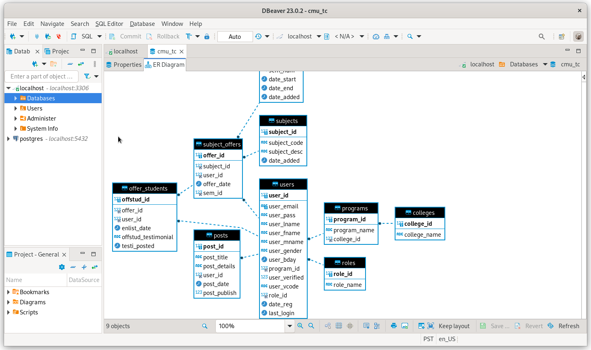
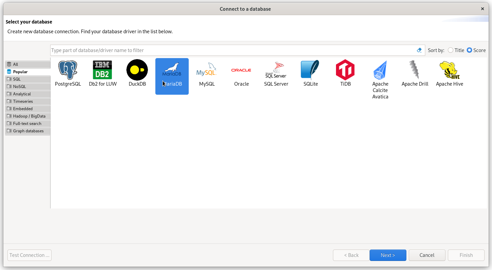
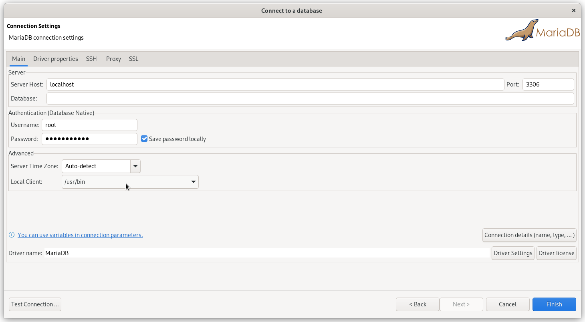
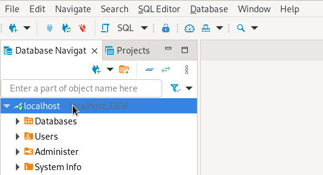
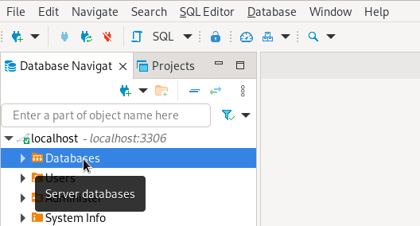
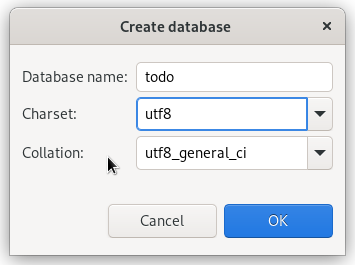
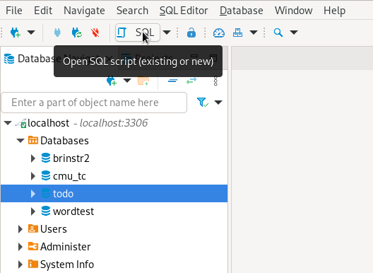
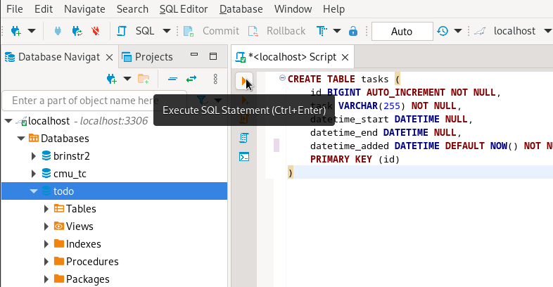
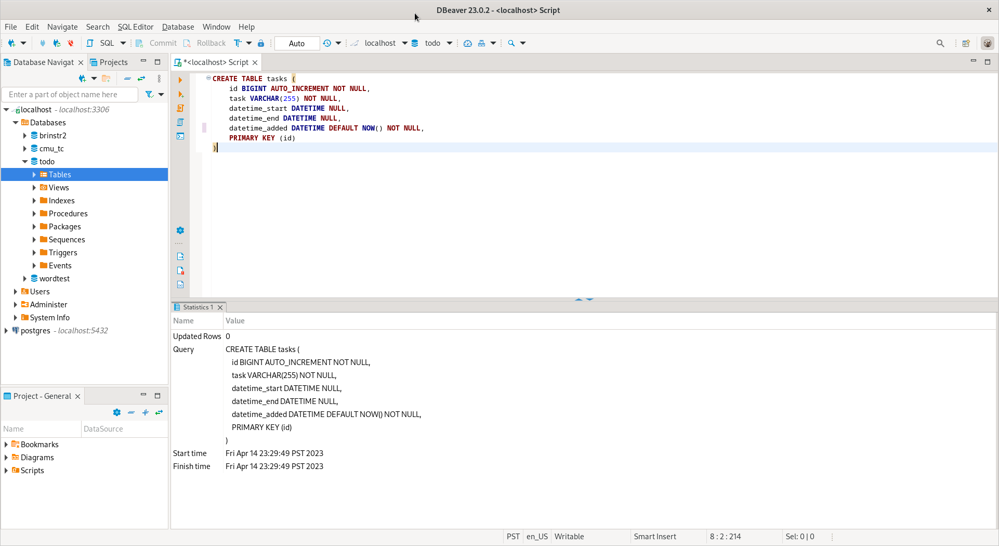
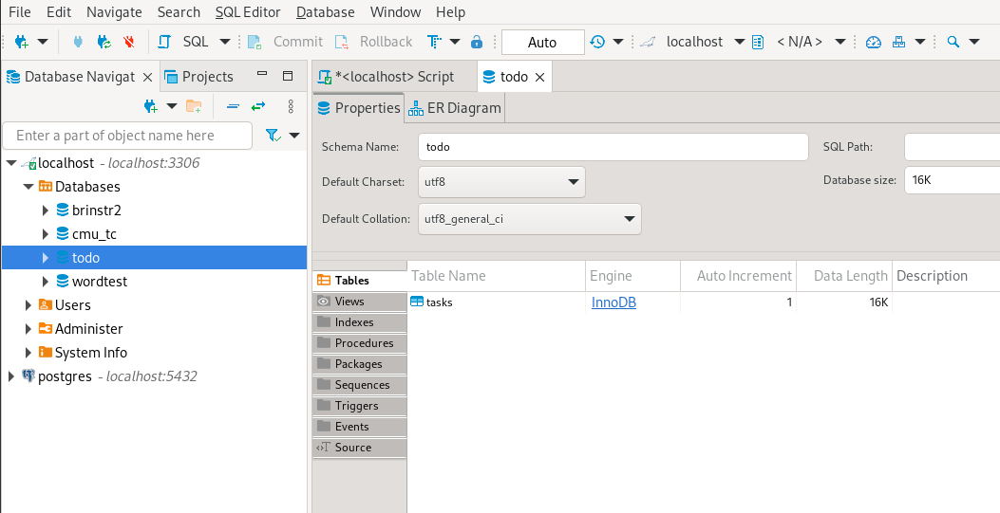

# Adding Database

To make your web application store data effectively, we will use a Database. Think of it as a notebook where we write
down notes stored in an organized manner. In this tutorial, we will be using MariaDB as our database.



MariaDB/MySQL can be managed using its built-in CLI client which may be difficult to use. There are GUI database
managers available such as the MySQL Workbench and phpMyAdmin. Those mentioned two database managers works only for
MariaDB/MySQL. For this tutorial, we will be using DBeaver, a free and open source client which supports multiple
databases.

To communicate with relational database servers like MariaDB/MySQL , we need to use `SQL (Structured Query Language)`.
SQL is a standard language for us to store, manipulate, and retrieve data in a database.

## Setting up MariaDB Connection
For us to manage our MariaDB server, we must be able to first setup its connection on DBeaver. To get connected with the
MariaDB server using DBeaver, follow the steps below:
Open the DBeaver, click the `New Database Connection` button below the File menu. After clicking, a new windows will
appear for you to setup the new connection. For this tutorial Select `MariaDB` as the database and click Next.



After selecting MariaDB, you will be required to provide basic connection settings such as the hostname, username, and
password. You may be also required to find the local installation MariaDB client on your machine. You can also press the
`Test Connection...` button to check if the settings provided is working.



If this is your first time adding a MariaDB server connection on DBeaver, it will download the connection driver for it
to work. This may take a few seconds/minutes depending on the internet connection speed. Once done, click `Finish` to 
save the new added connection. This will add a new entry on the Database Navigation pane on the left same as the image
shown below:




## Creating the Database and the Table
In this part, we will now be creating our database to store those task information for our app. Go back to the opened
window of DBeaver. Expand the newly added database connection, right click the `Databases` and select the
`Create New Database` option on the menu.



A `Create Database` prompt will show asking for a Database name, Charset, and Collation. Set the name to `todo`, the
character set to `utf8`, and the collation will be automatically set to `utf8_general_ci`. Once the values are set,
click `OK` to finally create the new database.

A `charset` is a set of characters while a `collation` is the rules for comparing and sorting a particular character
set (read more [here](https://mariadb.com/kb/en/character-set-and-collation-overview/)). `UTF-8` character set is used
since it widely supports almost of the characters in the world.



Without using the `Create Database` prompt, the equivalent SQL statement for creating a database for the Todo app is
shown below.

```sql
CREATE DATABASE todo DEFAULT CHARACTER SET utf8 COLLATE utf8_general_ci
```

After clicking `OK`, expand the `Databases` subcategory to check if the database named `todo` was successfully created.
If the database `todo` is not yet appearing, you can press `F5` to refresh the Database Navigator. If you can see the
`todo` database, select it and click the `SQL` button above to open the SQL Script pane same.



Once the SQL Script pane is open, copy the code below and paste it to the pane.

```sql
CREATE TABLE tasks (
	id BIGINT AUTO_INCREMENT NOT NULL,
	task VARCHAR(255) NOT NULL,
	datetime_start DATETIME NULL,
	datetime_end DATETIME NULL,
	datetime_added DATETIME DEFAULT NOW() NOT NULL,
	PRIMARY KEY (id)
)
```
The code above is a SQL which creates a table using the `CREATE TABLE` statement. A line by line explanation of the code
is provided below for your understanding:
* Creates a table named `tasks`
* Adds a field named `id` with a data type of `BIGINT` (wider range of integers compared to INT), it increments
automatically by 1, and it should be not null
* Adds a field named `task` with a data type of `VARCHAR` (characters) with a limit of 255 and it should be not null
* Adds a field named `datetime_start` with a data type of `DATETIME` (contains date and time) and it can contain null
value
* Adds a field named `datetime_end` with a data type of `DATETIME` (contains date and time) and it can contain null
value
* Adds a field named `datetime_added` with a data type of `DATETIME` (contains date and time) and it should be not null
* Sets the field `id` as a primary key (an attribute used to identify a record)

The `id` field is the primary key of the table `tasks`. It is used to identify every task stored in the table. To better
understand the idea of a primary key, a student has an ID number, and it only points to 1 student within a school even
if there's a lot of students. In this example the primary key is the ID number of the student.

The `task` field stores the task coming from the user input. Any text input will be stored as long as it fits to the
255-character limit.

The fields `datetime_start` and `datetime_end` stores the date and time when the task started and when the task ended.
It will be set to null by default and will be filled with timestamp when the task is started or ended. On the other
hand, `datetime_added` will be added with the current timestamp as its default value when the task is added. `NOW()` is
a function in SQL used to get the current timestamp.

To execute the `CREATE TABLE` statement, press the `Execute SQL Statement` button same as the image below. Once clicked,
the query in now expected to run successfully.



After a successful query execution, a pane on the bottom will show some basic information about it same as the image
below.



You can check if `tasks` table was successfully created on `todo` database. To do this, double click `todo` database to
open it on a new tab. By default, it is already on the `Tables` pane. It is expected to see `tasks` table on the pane.
If there is no tables present on the list, you can hit `F5` to refresh.



If you can see the `tasks` table on the Tables pane, Congratulations! You have successfully created the `tasks` table!

## Playing with the Tasks Table
In this section, you will now apply the basic CRUD (Create, Retrieve, Update, Delete) SQL statements. You will get to
know how to use `INSERT`, `SELECT`, `UPDATE`, and `DELETE` statements in manipulating your database.

Go back to the SQL Script pane and clear the query we used to create the table. We will try few basic query statements
used to manipulate data on a database.

### INSERT Statement
INSERT statement is used to add new record or row on a table.

```sql
INSERT INTO tasks(task) VALUES('Attend WebDev Basics Session')
```

The statement above means it will insert on `tasks` table supplying the `task` field with a value of
`Attend WebDev Basics Session`.

```sql
INSERT INTO tasks(task, datetime_start) VALUES('Eat my Snacks', NOW())
```

The statement above is used to insert a record providing a multiple values for the fields. The fields must
have a similar sequence to the values provided.

**Challenge:**
* Insert a `task` on the `tasks` table with a value of `Eat Dinner with Friends`
* Insert a record on the `tasks` table with a value of `Study for the Finals` for the `task` and `NOW()` for the
`datetime_start` 

### SELECT Statement
SELECT statement is used to retrieve records or rows on a table.

```sql
SELECT * FROM tasks
```

The statement above means it will retrieve all the records or rows on the `tasks` table. `*` means all fields will be
retrieved. You can specify the fields that will be retrieved by replacing the `*` with the column names seperated by a
comma.

```sql
SELECT * FROM tasks WHERE id=1
```

The statement above means almost the same with statement above except that it has `WHERE` clause filtering the result
set with only those records who have an `id` equal to 1. `WHERE` clause enables you add conditions in order to filter the
retrieved result set. Other operators such as `>`, `<`, `>=`,`<=`, `!=`, `LIKE`, `IN`, `BETWEEN` can be used too. `AND`
or `OR` keywords can be added to add another filtering operation.

```sql
SELECT * FROM tasks WHERE datetime_start IS NOT NULL
```

The statement above means it retrieves all records where `datetime_start` doesn't contain a null value.

```sql
SELECT * FROM tasks ORDER BY datetime_added DESC
```

The statement above retrieves all the records rows and sorting it in descending (`DESC`) order based on the
`datetime_added` values using the `ORDER BY` clause. `ORDER BY` clause enables you to sort the retrieved result set in
`ASC` (ascending, the default) or `DESC` (descending) order.

**Challenge:**
* Retrieve records from the `tasks` table with `id` and `task` columns only 
* Retrieve records from the `tasks` table with an `id` containing a value of more than 1

### UPDATE Statement
UPDATE statement is used to manipulate data from an existing records or rows. This is usually paired with `WHERE`
clause to target only those records that needs to be updated.

```sql
UPDATE tasks SET task='Updated this task using UPDATE statement' WHERE id=2
```

The statement above means it will do an update on the `tasks` table by changing `task` value to `Updated this task
using UPDATE statement` on a record with an `id` value of 2. You can pass multiple field changes by paring the field
names with values separating them with comma.

**Challenge:**
* Update `tasks` table by adding a value `NOW()` to the field `datetime_start` on a record with an `id` equal to 1

### DELETE Statement
DELETE statement is used to delete records or rows from a table. This is usually paired with `WHERE` clause
to target only those records that needs to be deleted.

```sql
DELETE FROM tasks WHERE id=1
```

The statement above means it will delete a record with an `id` equal to 1 from the `tasks` table.

**Challenge:**
* Delete a record from `tasks` table where `datetime_start` field contains a null value.

If you've reached this far, Congratulations! You are now ready to create the Todo application!
