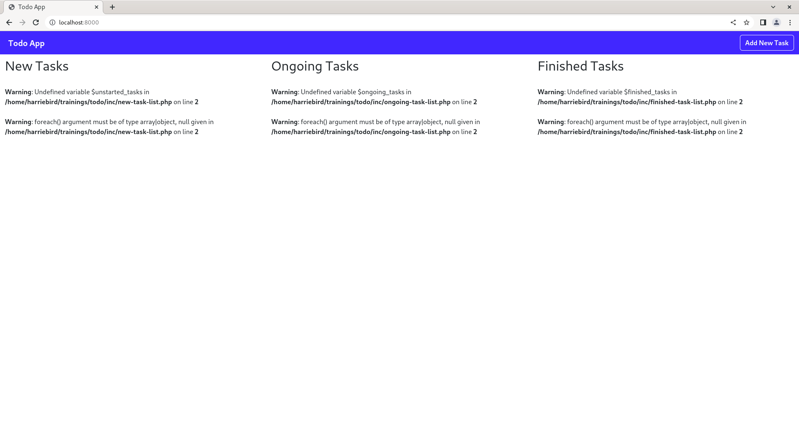

# Developing Todo App

Now, you have already an idea on how to manipulate data on a database. Let's get moving and develop the actual Todo App.

## Adding Bootstrap
[Bootstrap](https://getbootstrap.com/) is a sleek, intuitive, and powerful front-end framework for faster and easier
web development. We will be using this to make our Todo App presentable and easy to develop in terms of the frontend.

To add Bootstrap, you must link its CSS and JavaScript files into the app. First, add the viewport meta and the CSS
file by adding the code below inside the `<head>` tag.

```html
<meta name="viewport" content="width=device-width, initial-scale=1">
<link href="https://cdn.jsdelivr.net/npm/bootstrap@5.3.0-alpha3/dist/css/bootstrap.min.css"
      rel="stylesheet" integrity="sha384-KK94CHFLLe+nY2dmCWGMq91rCGa5gtU4mk92HdvYe+M/SXH301p5ILy+dN9+nJOZ" crossorigin="anonymous">
```

Second, include the JavaScript file by adding the code below before the `</body>` end tag.

```html
<script src="https://cdn.jsdelivr.net/npm/bootstrap@5.3.0-alpha3/dist/js/bootstrap.bundle.min.js"
        integrity="sha384-ENjdO4Dr2bkBIFxQpeoTz1HIcje39Wm4jDKdf19U8gI4ddQ3GYNS7NTKfAdVQSZe" crossorigin="anonymous"></script>
```

The resulting code should look like the code shown below: 

```html
<!DOCTYPE html>
<html lang="en">
<head>
    <title>Todo App</title>
    <meta charset="UTF-8">
    <meta name="viewport" content="width=device-width, initial-scale=1">
    <link href="https://cdn.jsdelivr.net/npm/bootstrap@5.3.0-alpha3/dist/css/bootstrap.min.css"
          rel="stylesheet" integrity="sha384-KK94CHFLLe+nY2dmCWGMq91rCGa5gtU4mk92HdvYe+M/SXH301p5ILy+dN9+nJOZ" crossorigin="anonymous">
</head>
<body>
    <h1>Hello world!</h1>
    <p>I will be now starting to create my first simple PHP web app. :)</p>
    <script src="https://cdn.jsdelivr.net/npm/bootstrap@5.3.0-alpha3/dist/js/bootstrap.bundle.min.js"
            integrity="sha384-ENjdO4Dr2bkBIFxQpeoTz1HIcje39Wm4jDKdf19U8gI4ddQ3GYNS7NTKfAdVQSZe" crossorigin="anonymous"></script>
</body>
</html>
```

Reload your browser and check the page. It is expected to get a different font style if Bootstrap kicks in. The resulting
page should look like the image shown below:


If the page now looks like the image shown above, Congratulations! You have successfully added Boostrap to the app.

## Creating the Main Page
On your project, create a folder named `inc`. The `inc` directory will hold the includes for this project. Separating
the code into files helps make the code easier to read and modify.

Inside the `inc` directory, create a file named `top-nav.php` and put the code below.

```html
<nav class="navbar navbar-expand-lg navbar-dark bg-primary fixed-top">
    <div class="container-fluid">
        <a href="/" class="navbar-brand fw-bold"><span class="bi-eye-fill me-2"></span>Todo App</a>
        <button type="button" class="btn btn-outline-light ms-auto fw-bold" data-bs-toggle="modal" data-bs-target="#add-modal">
            Add New Task
        </button>
    </div>
</nav>
```

The `data-bs-toggle="modal" data-bs-target="#add-modal"` on the `<button>` tag are HTML attributes for Bootstrap which
tells to toggle a modal and target a modal with an `id` of `add-modal`. The modal will show once the button is clicked.

On the `index.php`, include the `top-nav.php` file after the `<body>` opening tag. Use the code below to include the 
`top-nav.php` file:

```php
<?php include "inc/top-nav.php"; ?>
```

The `include()` function puts the code of the file (passed as an argument) to file where it was called. This will
add a Navbar on the top of the page.

We will be adding a Modal as prompt for adding a new task. Create an `addtask-modal.php` file inside the `inc` directory
and put the code below:

```html
<div class="modal fade" id="add-modal" tabindex="-1" aria-labelledby="add-modal-title" aria-hidden="true">
    <div class="modal-dialog">
        <div class="modal-content">
            <div class="modal-header">
                <h1 class="modal-title fs-5" id="add-modal-title">Add New Task</h1>
                <button type="button" class="btn-close" data-bs-dismiss="modal" aria-label="Close"></button>
            </div>
            <div class="modal-body">
                <form method="post">
                    <div class="mb-3">
                        <label for="task" class="form-label">Task Name</label>
                        <textarea class="form-control" name="task" rows="3"></textarea>
                    </div>
                    <div class="d-grid gap-2">
                        <button type="submit" class="btn btn-primary" name="action" value="add-task">Save Task</button>
                    </div>
                </form>
            </div>
        </div>
    </div>
</div>
```

Modal is a component coming from the Bootstrap. The code above is a modal used to add a new task for the app. The modal
has an `id` of `add-modal` which is targeted by the `Add New Task` button. Inside the modal, we just added the form to
add a new task. The form has the method set to `post`, this means it will submit the for as a `POST` request. The is no
`action` attribute specified on the form which means it submits the form to the current link of the page. The attribute
`name` on the `<input>` tags is important since it will be used in the retrieval of the form values when it is
submitted. The `<button>` with a type of `submit` on the form has a data named `action` with a value of `add-task`,
this will be used to identify the corresponding operation once the form is submitted.

On the `index.php`, include the `addtask-modal.php` file before the `<script>` tag for Bootstrap
JavaScript. Use the code below to include the `top-nav.php` file:

```php
<?php include "inc/addtask-modal.php"; ?>
```

This will add an `Add New Task` modal to the project.

On `index.php`, in between the two includes for `top-nav.php` and `addtask-modal.php`, put the code below:

```html
<div class="container-fluid">
    <div class="row mt-5">
        <div class="col-md-4 mt-3">
            <h2>New Tasks</h2>
        </div>
        <div class="col-md-4 mt-3">
            <h2>Ongoing Tasks</h2>
        </div>
        <div class="col-md-4 mt-3">
            <h2>Finished Tasks</h2>
        </div>
    </div>
</div>
```

This will add fluid container and 3 columns for the `New Tasks`, `Ongoing Tasks`, and `Finished Tasks`. The content of
`index.php` should look like the code below:

```html
<!DOCTYPE html>
<html lang="en">
<head>
    <title>Todo App</title>
    <meta charset="UTF-8">
    <meta name="viewport" content="width=device-width, initial-scale=1">
    <link href="https://cdn.jsdelivr.net/npm/bootstrap@5.3.0-alpha3/dist/css/bootstrap.min.css"
          rel="stylesheet" integrity="sha384-KK94CHFLLe+nY2dmCWGMq91rCGa5gtU4mk92HdvYe+M/SXH301p5ILy+dN9+nJOZ" crossorigin="anonymous">
</head>
<body>
<?php include "inc/top-nav.php"; ?>
<div class="container-fluid">
    <div class="row mt-5">
        <div class="col-md-4 mt-3">
            <h2>New Tasks</h2>
        </div>
        <div class="col-md-4 mt-3">
            <h2>Ongoing Tasks</h2>
        </div>
        <div class="col-md-4 mt-3">
            <h2>Finished Tasks</h2>
        </div>
    </div>
</div>
<?php include "inc/addtask-modal.php"; ?>
<script src="https://cdn.jsdelivr.net/npm/bootstrap@5.3.0-alpha3/dist/js/bootstrap.bundle.min.js"
        integrity="sha384-ENjdO4Dr2bkBIFxQpeoTz1HIcje39Wm4jDKdf19U8gI4ddQ3GYNS7NTKfAdVQSZe" crossorigin="anonymous"></script>
</body>
</html>
```


Now we have the modal working. What we are going to do right now is to make the Add New Task submission stored to the
database. We will add a PHP code to handle this thing. On the `inc` directory, create two files named `config.php` and
`database.php` and put the codes below.

Code for `config.php`:

```php
<?php
$DB_HOST = "localhost";
$DB_NAME = "todo";
$DB_PORT = 3306;
$DB_USER = "root";
$DB_PASS = "";
```

The `config.php` stores configuration for the web application. For now, it will just store database connection settings.
Provide your settings here according to your configuration. The values to provided below are the following:
* `$DB_HOST` contains the host name, domain, or IP of the database server. In our case, we can just use `localhost`.
* `$DB_NAME` contains the name of the database. We can just use the `todo` database we have created.
* `$DB_PORT` contains the port where the database server runs. MariaDB/MySQL run on port `3306` by default.
* `$DB_USER` contains the username of a user who has a full permission on the provided database name (`$DB_NAME`). In
our case, we can just use the `root` for now. But it is a practice to create a separate user especially on production.
* `$DB_PASS` contains the password of the user provided on the `$DB_USER`. The `root` user of MariaDB/MySQL database
bundled on XAMPP is blank by default. If you have created a password for your own user, you can provide it here.

Code for `database.php`:

```php
<?php
require "config.php";

function connect_db() {
    global $DB_HOST, $DB_USER, $DB_PASS, $DB_NAME, $DB_PORT;
    return mysqli_connect($DB_HOST, $DB_USER, $DB_PASS, $DB_NAME, $DB_PORT);
}

function add_task($task) {
    $query = "INSERT INTO tasks(task) VALUES('$task')";
    return mysqli_query(connect_db(), $query);
}
```

The `database.php` will contain functions related to the database. This will make our code easier to read and manage.
The `require` keyword works the same as `include` except that it terminates the script if the file specified is not
found. In case The `global` keyword in PHP imports the global-scoped variable into local scope of a function. The
`mysqli_connect()` function creates a new connection to the MariaDB server. It takes database connection information
such as the hostname, username, password, database name, and port as argument to successfully connect to the database
server.

The `connect_db()` function initializes database connection for our application and will be used with other
functions relating to database. The `add_task` function executes the `INSERT` statement to add a new task. The
`mysqli_query()` function executes the query to the connected MariaDB server. It accepts the `mysqli` and the actual
SQL query to be executed as arguments.

Above the `<!DOCTYPE html>` line on `index.php`, put the code below:
```php
<?php
require "inc/database.php";

if(isset($_POST["action"])) {
    if($_POST["action"] == "add-task") {
        add_task(htmlentities(($_POST["task"])));
    }
}
?>
```
The code above requires the `database.php` since we will be using the `add_task()` function. `$_POST` variable holds the
request data when using `POST` request. It will check if there is an `action` element inside the `$_POST` variable and
if the value is `add-task`, it will proceed to execute the `add_task()` function.

The `htmlentities()` function converts all characters to HTML entities. For this application, this implements a simple
way of securing form inputs from executing malicious codes (for example, XSS and SQL Injection). But if you will use
`PHP frameworks` (since you love to pursue Web Development), **using of `htmlentities()` highly discouraged** since
most of them provide sanitizers already.

You can now test the `Add New Task` modal to see if actually stores to the database. If it successfully stores new task
to the database, we can proceed to the adding of the `New Tasks`, `Ongoing Tasks`, and `Finished Tasks` display
functionality.

To start working on the tasks display functionality, open `database.php` and add the code below.
```php
function get_finished_tasks() {
    $query = "SELECT * FROM tasks WHERE datetime_start IS NOT NULL AND datetime_end IS NOT NULL ORDER BY datetime_added";
    return mysqli_query(connect_db(), $query);
}

function get_ongoing_tasks() {
    $query = "SELECT * FROM tasks WHERE datetime_start IS NOT NULL AND datetime_end IS NULL ORDER BY datetime_added DESC";
    return mysqli_query(connect_db(), $query);
}

function get_unstarted_tasks() {
    $query = "SELECT * FROM tasks WHERE datetime_start IS NULL AND datetime_end IS NULL ORDER BY datetime_added";
    return mysqli_query(connect_db(), $query);
}
```

The functions above queries for tasks that were `Done`, `Ongoing`, and `Unstarted`. The following criteria is used on
the SQL queries to check what category a task belongs:

| Category  | datetime_start | datetime_end |
|-----------|----------------|--------------|
| Unstarted | NULL           | NULL         |
| Ongoing   | NOT NULL       | NULL         |
| Finished  | NOT NULL       | NOT NULL     |

On the `inc` directory, create files named `edittask-modal.php`, `new-task-list.php`, `ongoing-task-list.php`, and
`finished-task-list.php`. Put the codes below on to its corresponding file name:

Code for `edittask-modal.php`:

```html
<div class="modal fade" id="edit-modal-<?php echo $task["id"]; ?>" tabindex="-1" aria-labelledby="edit-modal-<?php echo $task["id"]; ?>-title" aria-hidden="true">
    <div class="modal-dialog">
        <div class="modal-content text-dark">
            <div class="modal-header">
                <h1 class="modal-title fs-5" id="edit-modal-<?php echo $task["id"]; ?>-title">Edit Task</h1>
                <button type="button" class="btn-close" data-bs-dismiss="modal" aria-label="Close"></button>
            </div>
            <div class="modal-body">
                <form method="post">
                    <input type="hidden" name="id" value="<?php echo $task["id"]; ?>">
                    <div class="mb-3">
                        <label for="task" class="form-label">Task Name</label>
                        <textarea class="form-control" name="task" rows="3"><?php echo $task["task"]; ?></textarea>
                    </div>
                    <div class="d-grid gap-2">
                        <button type="submit" class="btn btn-primary" name="action" value="edit-task">Save Task</button>
                    </div>
                </form>
            </div>
        </div>
    </div>
</div>
```
The `edittask-modal.php` file contains the code for modal used to edit the task entries. The file is almost the same
with `addtask-modal.php` except that it has an `<input>` tag with a type of `hidden`, containing the `id` of the task
to be edited. It echoes the current task name on the `<textarea>`, and the `action` on the submit `<button>`
is `edit-task`.

Code for `new-task-list.php`:

```html
<h2>New Tasks</h2>
<?php foreach($unstarted_tasks as $task):?>
    <div class="card text-bg-secondary mb-3">
        <div class="card-body">
            <?php echo $task["task"]; ?>
        </div>
        <div class="btn-group" role="group" aria-label="Basic example">
            <a href="index.php?action=do-task&id=<?php echo $task["id"]; ?>" class="btn btn-primary">Do Task</a>
            <button type="button" class="btn btn-primary" data-bs-toggle="modal" data-bs-target="#edit-modal-<?php echo $task["id"]; ?>">Edit Task</button>
            <a href="index.php?action=delete-task&id=<?php echo $task["id"]; ?>" type="button" class="btn btn-danger">Delete Task</a>
        </div>
        <?php include "edittask-modal.php"; ?>
    </div>
<?php endforeach; ?>
```

Code for `ongoing-task-list.php`:

```html
<h2>Ongoing Tasks</h2>
<?php foreach($ongoing_tasks as $task):?>
<div class="card text-bg-primary mb-3">
    <div class="card-body">
        <?php echo $task["task"]; ?>
    </div>
    <div class="btn-group" role="group" aria-label="Basic example">
        <a href="index.php?action=finish-task&id=<?php echo $task["id"]; ?>" class="btn btn-primary">Finish Task</a>
        <button type="button" class="btn btn-primary" data-bs-toggle="modal" data-bs-target="#edit-modal-<?php echo $task["id"]; ?>">Edit Task</button>
        <a href="index.php?action=delete-task&id=<?php echo $task["id"]; ?>" type="button" class="btn btn-danger">Delete Task</a>
    </div>
    <?php include "edittask-modal.php"; ?>
</div>
<?php endforeach; ?>
```

Code for `finished-task-list.php`:

```html
<h2>Finished Tasks</h2>
<?php foreach($finished_tasks as $task):?>
<div class="card text-bg-success mb-3">
    <div class="card-body">
        <?php echo $task["task"]; ?>
    </div>
    <div class="btn-group" role="group" aria-label="Basic example">
        <button type="button" class="btn btn-primary" data-bs-toggle="modal" data-bs-target="#edit-modal-<?php echo $task["id"]; ?>">Edit Task</button>
        <a href="index.php?action=delete-task&id=<?php echo $task["id"]; ?>"  type="button" class="btn btn-danger">Delete Task</a>
    </div>
    <?php include "edittask-modal.php"; ?>
</div>
<?php endforeach; ?>
```

The files `new-task-list.php`, `ongoing-task-list.php`, and `finished-task-list.php` contains almost the same code. It
differs on what set of tasks to be displayed and corresponding buttons for its actions. The `foreach` loop iterates on
each task and stores it in the `$task` variable. This enables to access the values of fields associated on each task.

On the `index.php`, replace those `<h2>` tags with a PHP `include` linking those task list files (`new-task-list.php`,
`ongoing-task-list.php`, and `finished-task-list.php`). That portion on the `index.php` should look like this:

```html
<div class="container-fluid">
    <div class="row mt-5">
        <div class="col-md-4 mt-3">
            <?php include "inc/new-task-list.php"; ?>
        </div>
        <div class="col-md-4 mt-3">
            <?php include "inc/ongoing-task-list.php"; ?>
        </div>
        <div class="col-md-4 mt-3">
            <?php include "inc/finished-task-list.php"; ?>
        </div>
    </div>
</div>
```



Reload your browser, and you will see a page same as the image above. Don't worry, those files included above is not
yet enough to display those tasks. We must link those functions we added to the `database.php`. On the upper portion of
the `index.php`, add the code below before the `PHP` tag closing.

```php
$unstarted_tasks = get_unstarted_tasks();
$ongoing_tasks = get_ongoing_tasks();
$finished_tasks = get_finished_tasks();
```

The code above assigns the results of each function to their corresponding variables. The upper portion of the
`index.php` should look like this:

```php
<?php
require "inc/database.php";

if(isset($_POST["action"])) {
    if($_POST["action"] == "add-task") {
        add_task(htmlentities(($_POST["task"])));
    }
}
    
$unstarted_tasks = get_unstarted_tasks();
$ongoing_tasks = get_ongoing_tasks();
$finished_tasks = get_finished_tasks();
?>
```

Reload the browser, it is expected that you will see those tasks to its corresponding list. There are buttons found on
the bottom of each task. Those buttons are not working yet, you have to add its functions to make it work.

On the `database.php` file, put the codes below to implement the `delete_task`, `edit_task`, `do_task`, and
`finish_task` database functions for the app.

```php
function delete_task($id) {
    $query = "DELETE FROM tasks WHERE id=$id";
    return mysqli_query(connect_db(), $query);
}

function edit_task($id, $new_task) {
    $query = "UPDATE tasks SET task='$new_task' WHERE id=$id";
    return mysqli_query(connect_db(), $query);
}

function do_task($id) {
    $query = "UPDATE tasks SET datetime_start=NOW() WHERE id=$id";
    return mysqli_query(connect_db(), $query);
}

function finish_task($id) {
    $query = "UPDATE tasks SET datetime_end=NOW() WHERE id=$id";
    return mysqli_query(connect_db(), $query);
}
```

The functions above deals with `DELETE` and `UPDATE` SQL statements. It accepts `$id` as argument to target a specific
record of task stored on the table and execute its corresponding query.

On the `index.php`, you must add the codes to handle the request depending on the operation needed to be done. Since
the edit task is a `POST` request we have to put the codes for this inside the area where `POST` requests are handled.
On the top part of `index.php`, put this code inside the if statement for `if(isset($_POST["action"]))` after the end
of if statement `if($_POST["action"] == "add-task")`.

```php
    elseif($_POST["action"] == "edit-task" && isset($_POST["id"])) {
        edit_task($_POST["id"], htmlentities($_POST["task"]));
    }
```

The code above will handle the things needed for the task edits to be accomplished. The code inside the if statement
`if(isset($_POST["action"]))` on the `index.php` should look like this:

```php
if(isset($_POST["action"])) {
    if($_POST["action"] == "add-task") {
        add_task(htmlentities(($_POST["task"])));
    }
    elseif($_POST["action"] == "edit-task" && isset($_POST["id"])) {
        edit_task($_POST["id"], htmlentities($_POST["task"]));
    }
}
```

For the `delete_task`, `do_task`, and `finish_task` to be linked on the clickable buttons found on the user interface,
we must add a code to handle the requests related to those tasks. To make `delete_task`, `do_task`, and `finish_task`
work, put the codes below on the top part of `index.php`, after the lines of `if(isset($_POST["action"]))` statement
and before the line `$unstarted_tasks = get_unstarted_tasks();`.

```php
if(isset($_GET["action"]) && isset($_GET["id"])) {
    if($_GET["action"] == "do-task") {
        do_task(htmlentities($_GET["id"]));
    }
    if($_GET["action"] == "finish-task") {
        finish_task(htmlentities($_GET["id"]));
    }
    elseif($_GET["action"] == "delete-task") {
        delete_task(htmlentities($_GET["id"]));
    }
}
```

The code above handles the corresponding actions for `delete_task`, `do_task`, and `finish_task`. The `$_GET` variable
holds the request data when using GET request. The code on the top of the `index.php` should look like the code below:

```php
<?php
require "inc/database.php";

if(isset($_POST["action"])) {
    if($_POST["action"] == "add-task") {
        add_task(htmlentities(($_POST["task"])));
    }
    elseif($_POST["action"] == "edit-task" && isset($_POST["id"])) {
        edit_task($_POST["id"], htmlentities($_POST["task"]));
    }
}

if(isset($_GET["action"]) && isset($_GET["id"])) {
    if($_GET["action"] == "do-task") {
        do_task(htmlentities($_GET["id"]));
    }
    if($_GET["action"] == "finish-task") {
        finish_task(htmlentities($_GET["id"]));
    }
    elseif($_GET["action"] == "delete-task") {
        delete_task(htmlentities($_GET["id"]));
    }
}

$unstarted_tasks = get_unstarted_tasks();
$ongoing_tasks = get_ongoing_tasks();
$finished_tasks = get_finished_tasks();
?>
```


Now, Reload the page on your browser. Try pressing those buttons found below on each task. If those buttons work
according to its function, you have now successfully developed the Todo App. Congratulations! :)