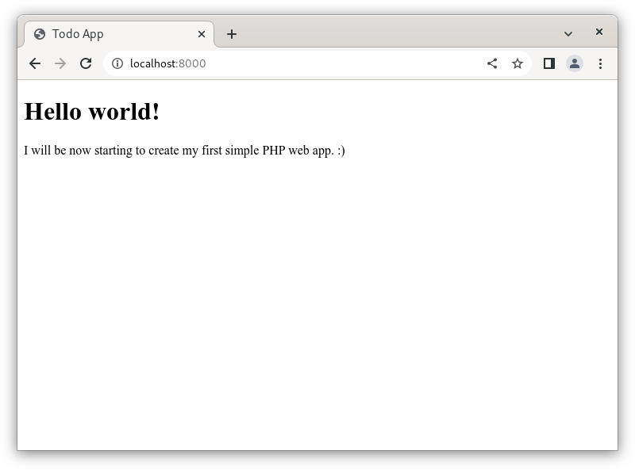

# Getting Started

## First HTML Page
If you are using XAMPP, find the `htdocs` directory on where it was installed. This is the directory which Apache (web
server) is serving. Backup (if you have placed important stuffs already) or remove all the files and folders inside
`htdocs` directory. By default, the Apache web server bundled in XAMPP runs in port 80. You can access this on the 
browser using the address `http://localhost`.

**Alternatively, you can use the PHP's built-in web server if you haven't installed XAMPP.** This will serve the files 
inside the working directory on where the command was executed. Create a directory on where you will be storing the code
for the Todo App. You can use the command below to use the PHP's built-in web server:

`php -S 0.0.0.0:8000`

The command above will run a web server exposed on port 8000. You can access this on browser using the address
`http://localhost:8000`.

With the text editor or IDE of your choice, open the htdocs or the directory where your project is located. Once it is
opened, create a file with a name of `index.php` and paste put the code below.

```html
<!DOCTYPE html>
<html lang="en">
<head>
    <title>Todo App</title>
    <meta charset="UTF-8">
</head>
<body>
    <h1>Hello world!</h1>
    <p>I will be now starting to create my first simple PHP web app. :)</p>
</body>
</html>
```

Here, we explain the anatomy of a simple web page:
* The `<!DOCTYPE html>` tells the browser that we are writing and render it as HTML5.
* The `<html>` tag defines the root element and the content of the web page.
* The `<head>` tag contains things included on the page but will not be directly shown.
* The `<title>` tag sets the page title.
* The `<meta charset="UTF-8">` sets the character set to `UTF-8`, which supports most of the languages written by human.
  * A `character set` is a system of encoding making the computers recognize a character.
* The `<body>` tag contains those things that is shown on the page.
* The `<h1>` tag is used to define an HTML heading. The heading starts from `<h1>` (the biggest and most important) to
`<h6>` (the smallest and least important).
* The `<p>` tag is used to define a paragraph.

Open a browser and visit the address where your project is currently served. On your browser, you should see a page same
as the image below:



If you can see a page similar to the image above, then you have successfully started your web server. Congratulations!
