# Gitting Started with Git

This paired activity enables you get a hands-on experience of using Git.

## A little bit about Git
Version control is a system that **records changes to a file or set of files over time** so that you can recall]
specific versions later. [Git](https://git-scm.com/) is a free and open source distributed version control system
designed to handle everything from small to very large projects with speed and efficiency. It was made by Linus
Torvalds in year 2005 with the original intention of using it for the development of Linux kernel. Magically, rapidly
spread and was adapted by other projects.

Below are the benefits of using Git:
* Easier Collaboration
* Proper Version Handling
* It's Free
* It's Multi-Platform

### States of Git
* **Committed** - the data is safely stored in the local database
* **Modified** - changed the file(s) but have not committed it to the database yet
* **Staged** - marked a modified file(s) in its current version to go into the next commit snapshot

### Main Sections of a Git Project
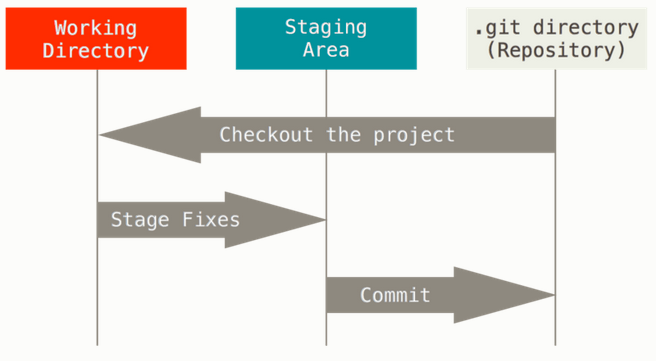
* **Working Directory** - working tree is a single checkout of one version of the project. These files are pulled out
of the compressed database in the Git directory and placed on disk for you to use or modify
* **Staging Area** - a file, generally contained in your Git directory, that stores information about what will go into
your next commit
* **Git Directory** - where Git stores the metadata and object database for your project

### Basic Git Workflow
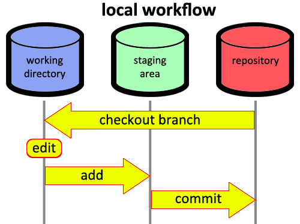

* **Modify** files in your working tree.
* Selectively **stage** just those changes you want to be part of your next commit.
* Do a **commit**, which takes the files as they are in the staging area and stores that snapshot permanently to your
Git directory.

### Git Branches
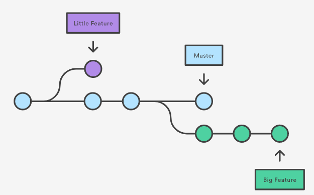

* Branch is **essentially an independent line of development**.
* Take advantage of branch **when working on new features or bug fixes**.

### Remote Repositories


Remote repositories are versions of the project that are **hosted on the Internet or network somewhere**.

## Gitting Your Hands Dirty with Git
In this portion, you will get to experience the basics of Git hands-on. You will get to create an example project
written in HTML and use Git commands. Above all, focus more on how Git is used on a project.

If you haven't installed Git yet, you can download its installer from the [Downloads Page](https://git-scm.com/downloads). It officially supports
Linux/Unix, macOS, and Windows.

For the purpose of pushing your code to a remote repository, a [GitHub](https://github.com/) account must be already
created.

You can install and use [VS Code](https://code.visualstudio.com/Download) to edit the code in this hands-on activity.

This activity guides you in using Git from an initialized local repository and not from a cloned repository.

### Initializing the Project and Integrating Git
Create a directory on your User folder named `my-first-git`. Open the folder with the text editor. Modern IDEs and Text
Editors usually ask if the opened project folder will be trusted or not. You can just click Yes or trust the project
directory to be opened with the Text Editor. The image show below show an example of trust project prompt in VS Code.

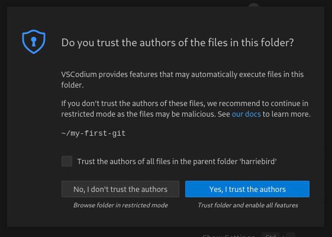

Once the Project is opened with your text editor, create a file named `index.html` inside the project directory and put
the code below.

```html
<!DOCTYPE html>
<html lang="en">
<head>
    <title>Hello world!</title>
    <meta charset="UTF-8">
</head>
<body>
    <h1>Hello world!</h1>
    <p>I will be now starting to create my first project. :)</p>
</body>
</html>
```
Don't forget to **save** it. You can also open `index.html` in a browser to see how it looks (90s website, huh?).

### Your first Commit
To execute Git commands on CLI, you must open a Command Prompt or Terminal. Change the working directory of the
terminal to the location of the project. Execute the `git init` command below in the terminal to initialize the
directory with a local Git repository. The important part on that command output is that it was successful in creating a
local Git repository in your project directory.

```bash
git init .
```

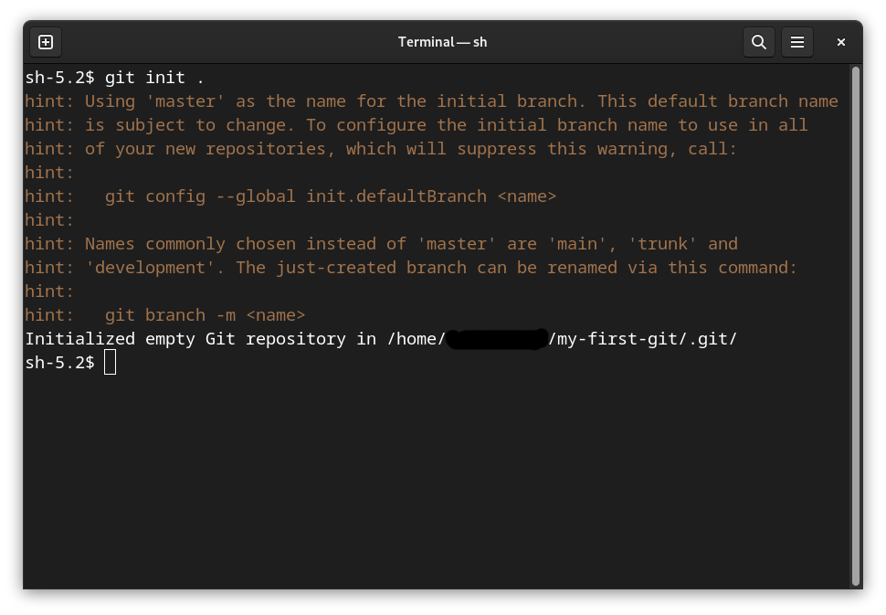

The image above is an example of an output of a `git init` command. Don't worry with the text colored in brown. It's
just telling you that on how to change default branch name and suggested branch names. By default, `master` is used to
name the initial branch.

After initializing the local repository, you must have to set the username and email the Git configuration before you
can be allowed to commit. This can be achieved by using the `git config` command same as show below. Replace
`<name-on-github>` with your name and `<email-on-github>` with the email you used to register to GitHub.

```bash
git config user.name "<name-on-github>"
git config user.email "<email-on-github>"
```

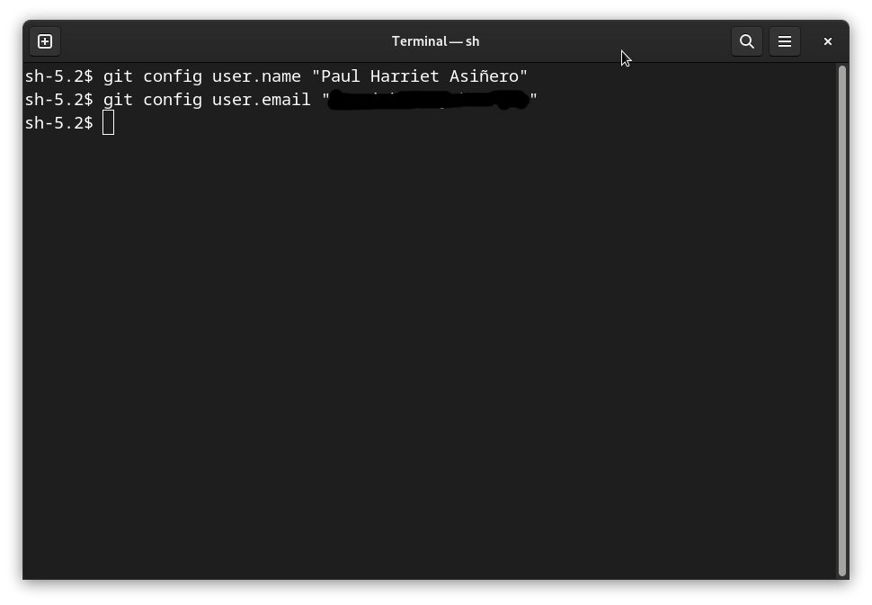

You can also check the values set on configuration by issuing `git config` command without passing the value. For
example, you can execute `git config user.name` command to check the current value set to the `user.name` setting.

You can always use `git status` to check the current status of the local repository same with the image below.

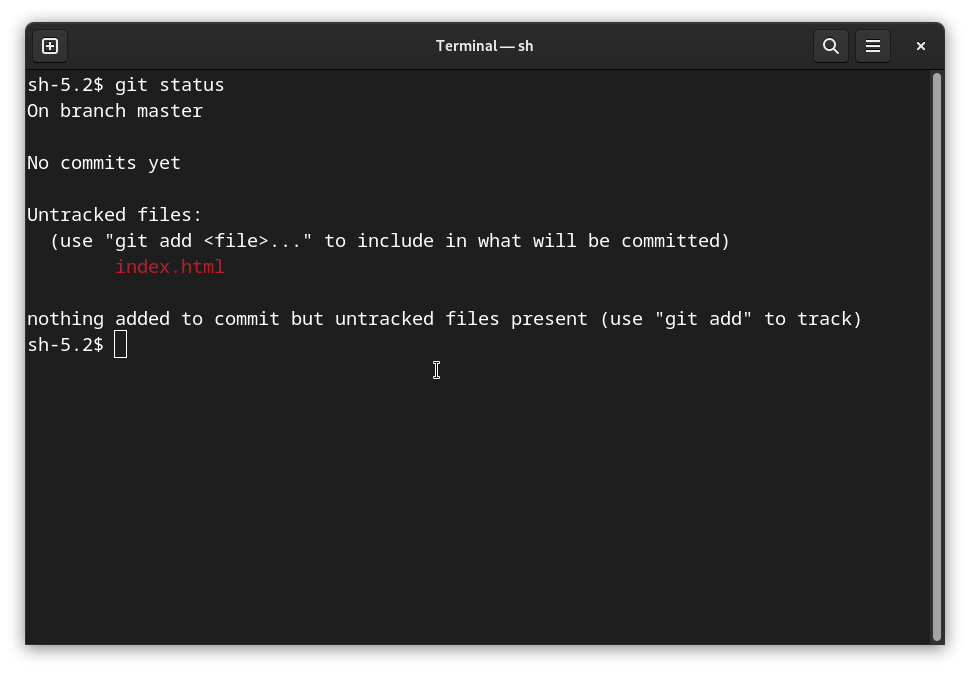

After configuring username and email in Git, you are now ready to commit the HTML code you wrote. Before files/folders
can be committed, it must be first added to staging area. To do this, you will have to use `git add` command.

```bash
git add index.html
```

Once the `index.html` is already added to the staging area, you can now commit it to the repository using the
`git commit` command.

```bash
git commit -m "Initial commit"
```
The `git commit` command requires a descriptive message. It recommended to put a message that briefly describes what
changes are include on the commit. For example, on the command show above, the descriptive message was `Initial commit`
since it was the first commit on the repository. The commit will be added to the `master` branch since it is the
initial default branch.

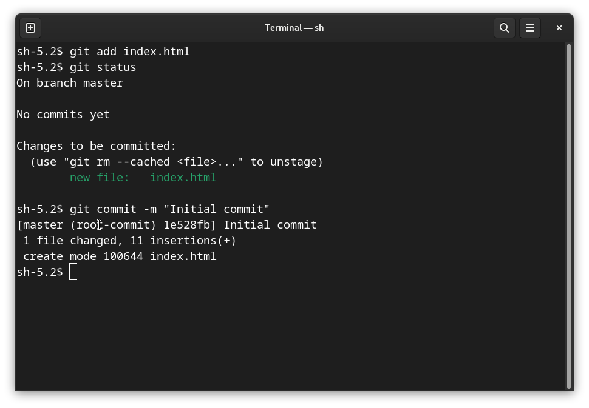

The image above shows example outputs of `git status` (when the files are in the staging area) and `git commit`
commands.

If you are now in this part of the activity, it means you have successfully created and initial commit on the local
repository. You are now ready to push your code into a remote repository. In this activity, GitHub is the remote
repository. 

### Your First Push to a Remote Repository
Before you can interact with GitHub, you must first log in your account. Once logged in, you can now create a remote
repository. To create a remote repository, click `add` button on the right and select `New repository` as shown on the
below.

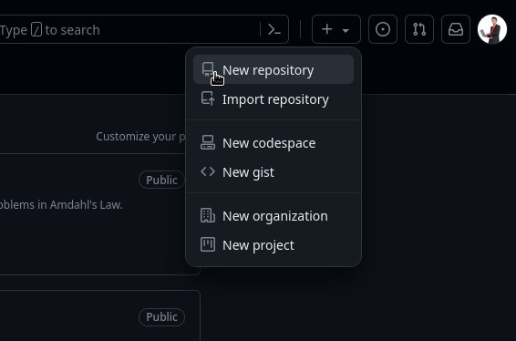

This will lead you to the `Create a new repostory`. Supply `my-first-git` as the Repository name and leave the other
fields to their defaults. Click the `Create repository` button to add the new repository on your account. 

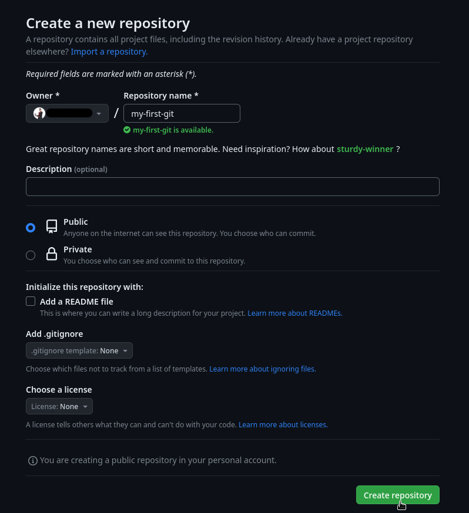

If the remote repository creation successful, it will lead to Quick setup page same as the image shown below.

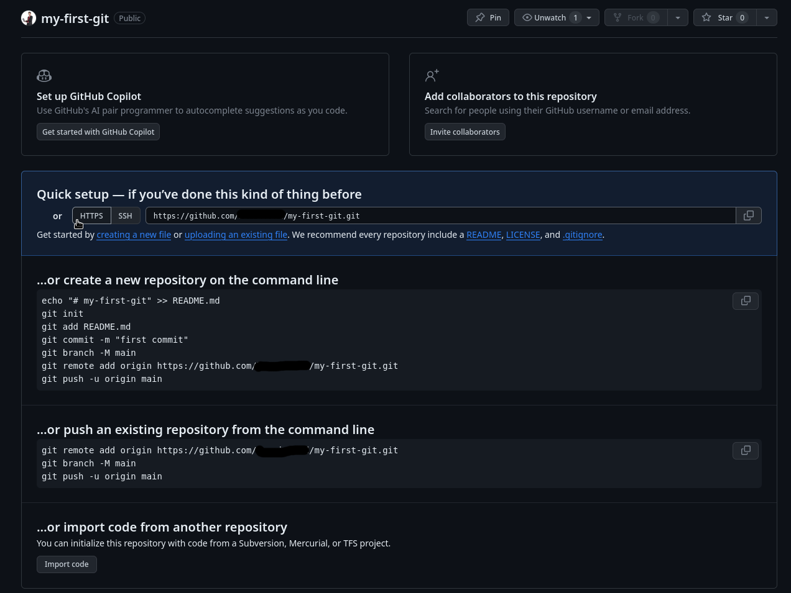

On the Quick setup page, click the `HTTPS` button to switch the Remote repository URL into HTTPS. Copy the HTTPS URL
for it will be used in adding a remote repository on the project.

Go back to the terminal, execute a `git remote add` command. Replace the `<HTTPS-URL>` with HTTPS URL you copied from
the Quick setup page.

```bash
git remote add origin <HTTPS-URL>
```
The command above adds a remote repository link on the local with an alias of `origin`. It is allowed to add multiple
remote repositories in a one local repository.

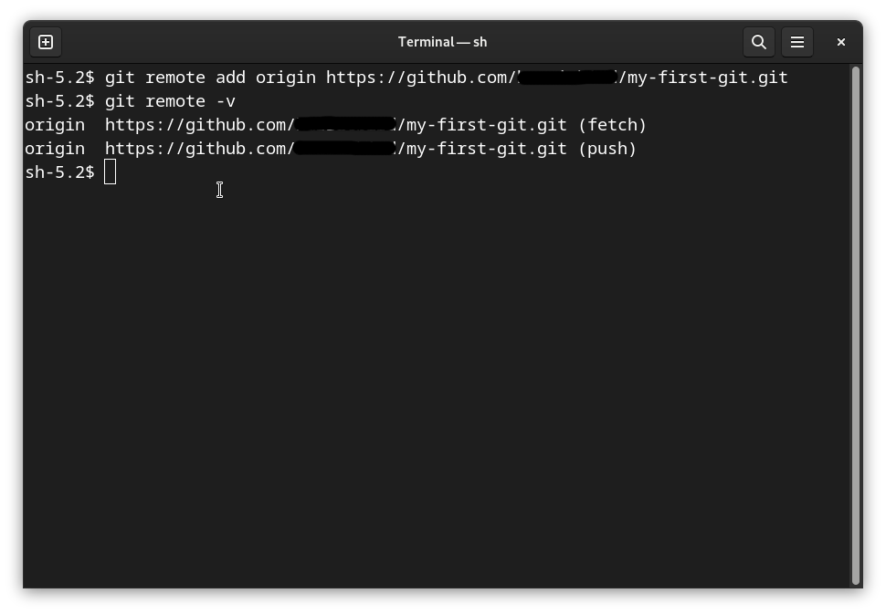

You can use `git remote -v` command to list all the linked remote repository in your project same with what is shown on
the image above. Now, you are ready to push your code to the remote repository you've just created.

To push your code in the remote repository, you can use the `git push` command. In the command you have to supply the
alias of the remote repository and the branch to be pushed.

```bash
git push <remote-alias> <branch-name>
```

On the command above, replace `<remote-alias>` with the alias assigned to the remote repository and also replace
`<branch-name>` with the name of the branch to be pushed.

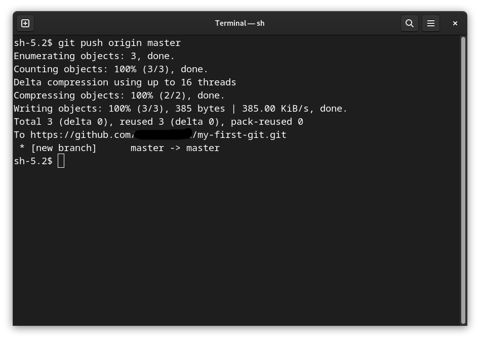

During the first time push, there will be cases that it will ask for your GitHub credentials. Supply your credentials
to allow the push to happen. A successful push will have a similar result as the image shown above.

Once the `master` branch was successfully pushed, you can now reload the web page of your repository to see the updated
remote repository.

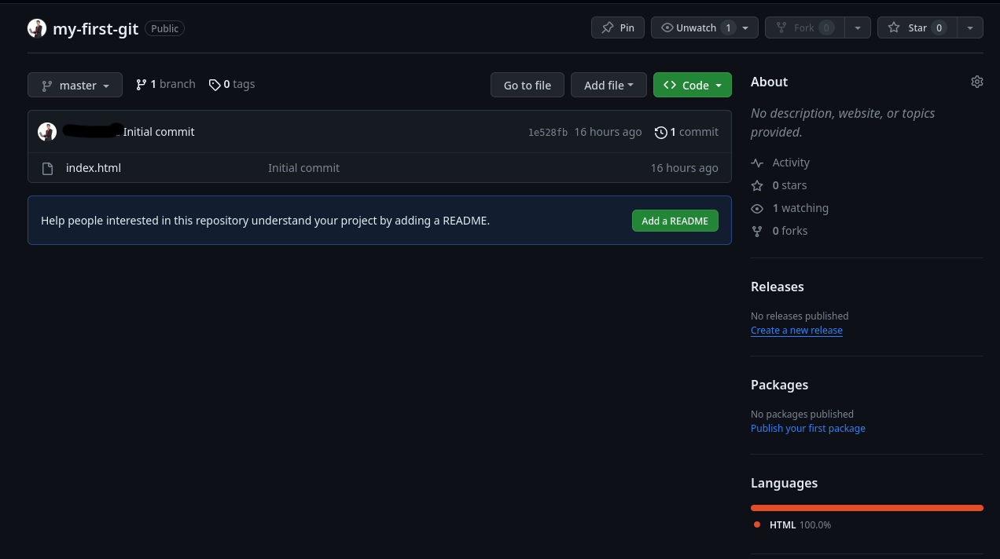

If the page of your remote repository looks like the image shown above, Congratulations! You have successfully pushed
your first repository on the GitHub.

## Add New Files for the Second Commit
This time, you will be trying to add 2 new files, the `README.md` and `about.html`. `README.md` is a markdown file that
usually contains information about the project such as the description, requirements, and setup guide. In your case,
you will just add a `README.md` containing a simple description about this project. Create a file named `README.md` and
put the code below.

```markdown
# my-first-git

This project is a result of a hands-on activity for Git Basics.
In this activity, I was able to execute the following:

* Create a locally initialized Git Repository
* Add files to staging area and commit code changes
* Create a remote repository on GitHub
* Pushing the code changes to the remote repository
* Cloning a project from a remote repository
```

The code above is written in Markdown. `#` represents a heading similar to the `<h1>` tag in HTML. `*` represents an
item in an unordered list. In fact, this guide was written in Markdown and powered by 
[HonKit](https://honkit.netlify.app/), a Node.js library that builds books and web pages from Markdown files.
If you want to know more about Markdown, visit 
[Markdown Basic Syntax](https://www.markdownguide.org/basic-syntax/).

You are now done creating and writing the content for `README.md`. Now, it's time to create the file named
`about.html`. Inside `about.html`, put the HTML codes below.

```html
<!DOCTYPE html>
<html lang="en">
<head>
    <title>About me</title>
    <meta charset="UTF-8">
</head>
<body>
    <h1>About Me</h1>
    <p>Go back to <a href="index.html">index page</a></p>
    <p>Write something about yourself here...</p>
</body>
</html>
```

You can write something about yourself inside the second `<p>` (paragraph) tag if you want. :)

After creating `about,html`, you are going to update `index.html`. Inside `index.html`, insert the code show below
after the `<p>` (paragraph) tag on the line 9.

```html
<p>Read <a href="about.html">about me</a></p>
```

The code in `index.html` should look like the lines of code below.

```html
<!DOCTYPE html>
<html lang="en">
<head>
    <title>Hello world!</title>
    <meta charset="UTF-8">
</head>
<body>
    <h1>Hello world!</h1>
    <p>I will be now starting to create my first project. :)</p>
    <p>Read <a href="about.html">about me</a></p>
</body>
</html>
```

Since you have already created and updated the projects files, you can now execute a `git status` command to the
current status of your repository. You can now add those files into the staging area by using `git add .` command,
preparing them to be committed. 

```bash
git add .
```

The command above is one way of using `git add` command. Instead of passing the file name as the argument, you can use
`.` (dot) or `-A` as an argument to make Git include all files that are changed, new, and even deleted into the staging
area.

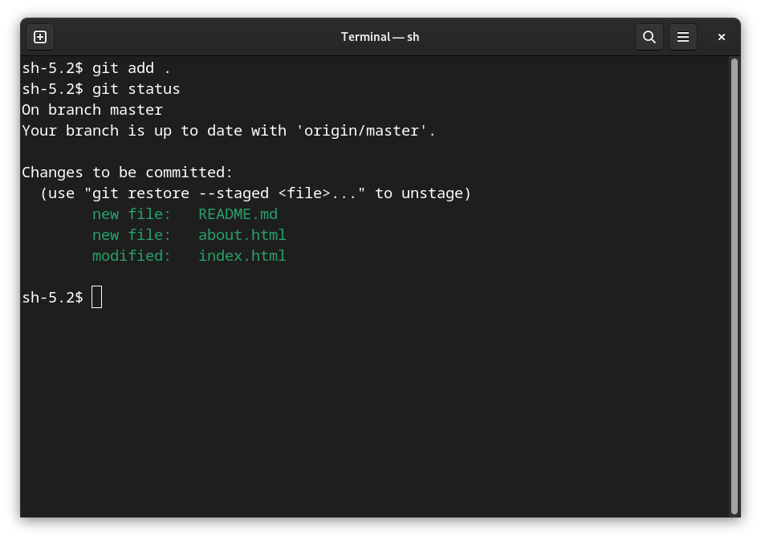

After adding those file changes to the staging area, You can execute a `git status` command to check those file changes
include in the staging area. In the image shown above, you can see that `README.md` and `about.html` were tagged as new
files. This is because the two files were currently untracked, meaning they are not yet included in any of the previous
commits made in the Git repository. On the other hand, `index.html` is modified since it was already included in the
previous commit (specifically the Initial commit).

At this point, you are now ready to commit those changes in the repository. Use `git commit` to commit those changes
from the staging area.

```bash
git commit -m "Added about.html and README.md"
```

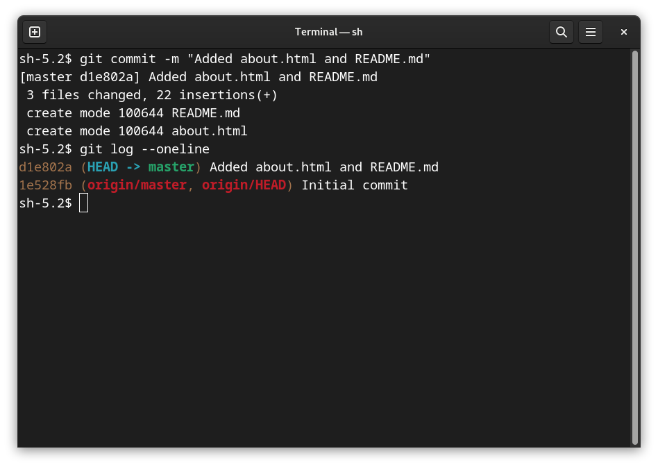

The image above shows the outputs of `git commit` and `git log --oneline` commands. The command `git log --oneline`
displays a simplified view of Git logs. The seven characters in the left colored with brown is the short commit hash.
This is used to identify a specific commit in the repository. It can be used in commands like the `git reset`,
where you have to put the short commit hash as value.

After committing code change into the local repository, you can now push it to the remote repository. Again, use the
`git push` command to push the branch containing the recent code changes.

```bash
git push origin master
```

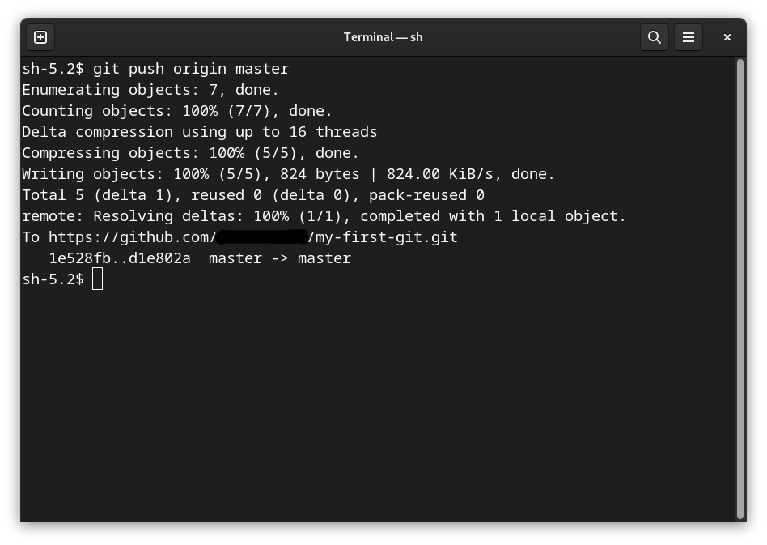

Once the updated version of the `master` branch was already pushed, you can now reload the page of your remote
repository.

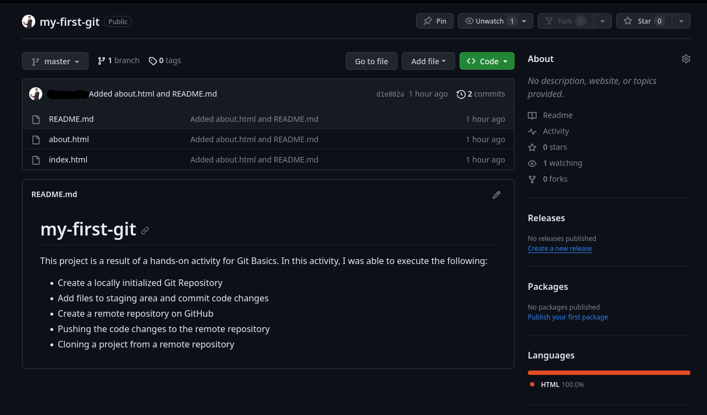

After the reload, the remote repository page must render the contents of the `README.md` file. Having a `README.md`
file in your projects helps a lot in making other users or developers get informed of what your project is all about.


### Initializing from a Project Using Git Clone

Before you proceed, **delete** the **my-first-git** folder on your computer.

If a project is already existing from a remote repository, you can use `git clone` command to clone the project in your
local machine. To do this, you must obtain the URL of the project. In GitHub, you can click the `Code` button to
display the URL of the repository same with the image shown below. Don't forget to copy the URL.

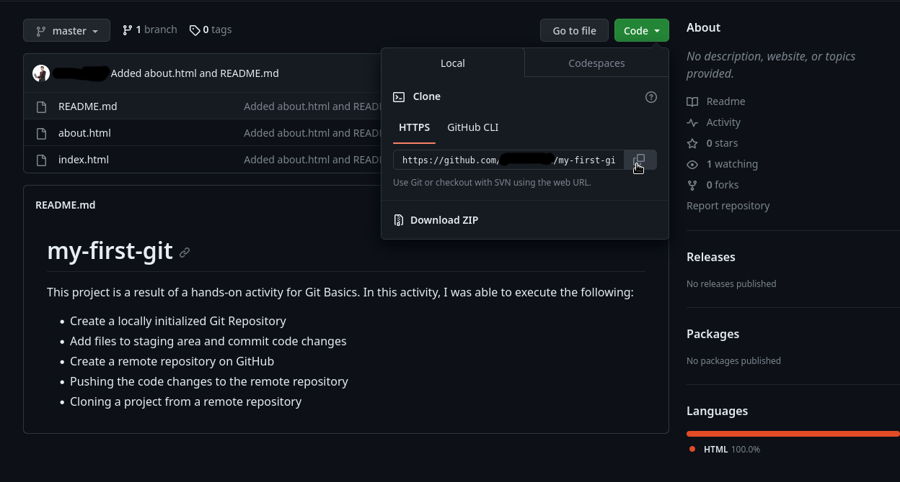

The `git clone` needs the URL of the repository for it to work. Replace `<HTTPS-URL>` with the actual URL copied from
the remote repository page. Run the `git clone` command.

```bash
git clone <HTTPS-URL>
```

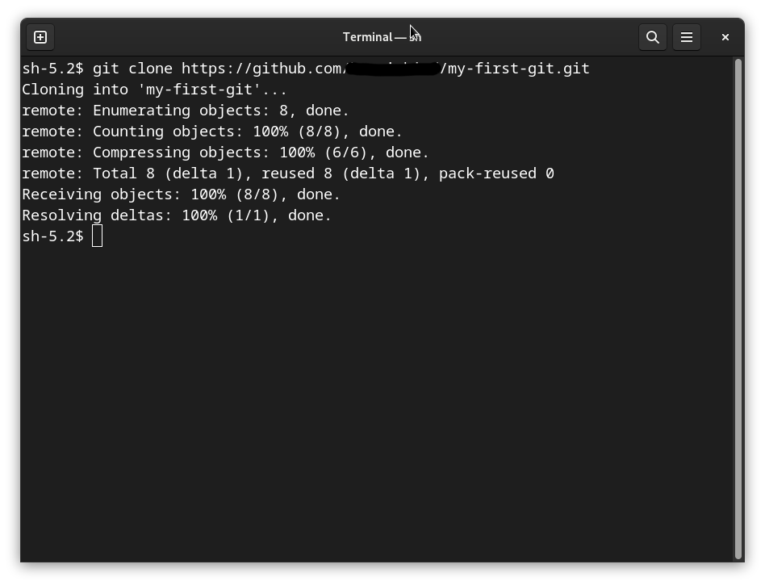

A successful `git clone` command will have a similar output from the image above. 

Congratulations! You are now done with the hands-on activity of Git basics. Hopefully, you find this activity
awesome. :)

## What's Next?
Since everything about Git can't be taught with the time allotted for this event. Here are some things you must do to
master the use of Git:

* Start **implementing Git** with your **projects**
* Learn **Feature Branching** and **Rebase**
* Learn about **Merge/Pull Requests** and **Code Review**
* Learn to **resolve Merge Conflicts**

If you find this guide cool and awesome, please do leave a star in its
[GitHub Repository](https://github.com/harriebird/php-todo-guide). Cheers! :)